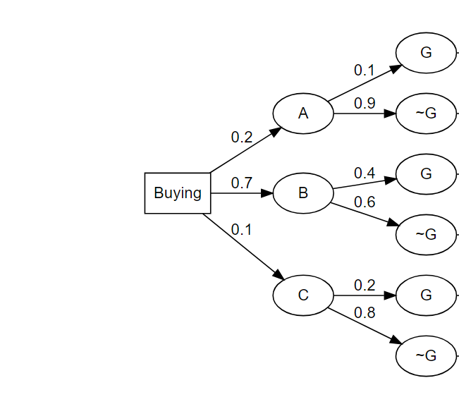

FA5_KHAFAJI
================
Mostafa Khafaji
2024-03-07

## Question 1

An email message can travel through one of three server nodes. The
percentage of errors in each of the servers and the percentage of
messages that travel through each route are shown in the following
table. Assume that the servers are independent

    ##    servers Percentage_messages Percentage_Errors
    ## 1 server_1                0.40             0.010
    ## 2 server_2                0.25             0.020
    ## 3 server_3                0.35             0.015

**(A) What is the probability of receiving an email containing an
error?**

We can simply get the sum of the product of the percentage of messages
in each server and their respective error percentage:

``` r
error_p <- sum(apply(s_df[, 2:3], MARGIN = 1, prod))

cat("The probability of an email containing an error is ",error_p*100,"%\n\n", sep = "")
```

    ## The probability of an email containing an error is 1.425%

**(B) What is the probability that a message will arrive without
error?**

We can simply take the complement of the above answer:

``` r
no_error_p <- 1- error_p

cat("The probability of an email containing no error is ",no_error_p*100,"%\n\n", sep = "")
```

    ## The probability of an email containing no error is 98.575%

**(C) If a message arrives without error, what is the probability that
it was sent through server 1?**

we can think of what is being asked as “the probability that the email
was sent through server 1, given that it arrives without error”

then,

p(Server1\|No error) = p(Server1 ∩ No Error)/p(No Error)

``` r
p_c <- (s_df[1,2]*(1-s_df[1,3]))/no_error_p
cat("The probability of message being sent through server 1, given that there is no error, is ",p_c*100,"%\n\n", sep = "")
```

    ## The probability of message being sent through server 1, given that there is no error, is 40.17246%

## Question 2

A software company surveyed managers to determine the probability that
they would buy a new graphics package that includes three-dimensional
graphics. About 20% of office managers were certain that they would not
buy the pack- age, 70% claimed that they would buy, and the others were
undecided.

Of those who said that they would not buy the package, only 10% said
that they were interested in upgrading their computer hardware. Of those
interested in buying the graphics package, 40% were also interested in
upgrading their computer hardware. Of the undecided, 20% were interested
in upgrading their computer hardware.

Let A denote the intention of not buying, B the intention of buying, C
the undecided, and G the intention of upgrading the computer hardware

we can table it by:

    ##   Decision Percentage_decision   G
    ## 1        A                 0.2 0.1
    ## 2        B                 0.7 0.4
    ## 3        C                 0.1 0.2

**(A) Calculate the probability that a manager chosen at random will not
upgrade the computer hardware (P(~G))**

We can simply find the sum of the products of each decision and their
respective probability that they are interested, and find the
complement.

``` r
no_up_p <- 1-sum(apply(soft_df[,2:3],MARGIN = 1,prod))
cat("The probability that a manager chosen at random will not upgrade the computer hardware is ",no_up_p*100,"%\n\n", sep = "")
```

    ## The probability that a manager chosen at random will not upgrade the computer hardware is 68%

**(B) Explain what is meant by the posterior probability of B given G,
P(B\|G).**

That, the probability of if a random manager is interested in upgrading
their system, the manager will buy the product.

We can write the formula as:

p(B\|G) = p(B∩G)/p(G)

``` r
p_b <- prod(soft_df[2,2:3])/sum(apply(soft_df[,2:3],MARGIN = 1,prod))
cat("The probability that if a random manager is interested in upgrading their system, the manager will buy the product is ",p_b*100,"%\n\n", sep = "")
```

    ## The probability that if a random manager is interested in upgrading their system, the manager will buy the product is 87.5%

**(C) Construct a tree diagram and use it to calculate the following
probabilities: P(G), P(B\|G), P(B\|~G), P(C\|G), P(<sub>C\|</sub>G).**

<!-- -->

**P(G) = 0.02 + 0.28 + 0.02 = 0.32**

**P(B\|G) = 0.28/0.32**

    ## p(B|G) = 87.5%

**P(B\|~G) = 0.42 / 0.18+0.42+0.08**

    ## p(B|~G) = 61.76471%

**P(C\|G) = 0.02/0.32**

    ## p(C|G) = 6.25%

**P( ~ C\| ~G) = (0.42+0.18)/(0.18+0.42+0.08)**

    ## p(~C|~G) = 88.23529%

## Question 3

A malicious spyware can infect a computer system though the Internet or
through email. The spyware comes through the Internet 70% of the time
and 30% of the time, it gets in through email. If it enters via the
Internet the anti-virus detector will detect it with probability 0.6,
and via email, it is detected with probability 0.8.

we can tabulize it as:

    ##     medium prob_medium antivirus_detect
    ## 1 Internet         0.7              0.6
    ## 2    Email         0.3              0.8

**(a) What is the probability that this spyware infects the system?**

Lets take the complement of the probability that an antivirus detects
the virus:

Again, 1-sum of the product of the respective probabilities:

``` r
vir_p <- 1-sum(apply(vir_df[,2:3],MARGIN = 1,prod))
cat("The probability that that this spyware infects the system is ",vir_p*100,"%\n\n", sep = "")
```

    ## The probability that that this spyware infects the system is 34%

**(b) If the spyware is detected, what is the probability that it came
through the Internet?**

the question is essentially asking p(Internet\|antivirus_detect)

= p(Internet ∩ Antivirus_detect)/p(Antivirus_detect)

``` r
bb_p <- prod(vir_df[1,2:3])/sum(apply(vir_df[,2:3],MARGIN = 1,prod))
cat("The probability that If the spyware is detected, it came through the Internet is ",bb_p*100,"%\n\n", sep = "")
```

    ## The probability that If the spyware is detected, it came through the Internet is 63.63636%
