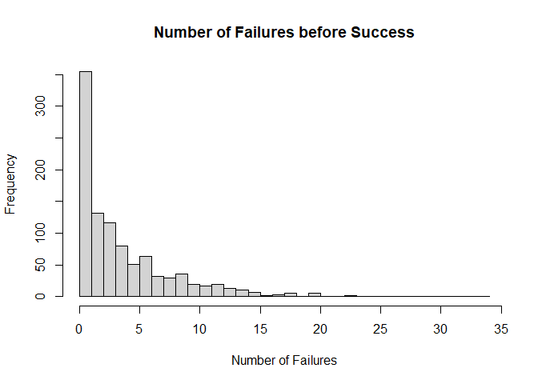

FA6_KHAFAJI
================
Mostafa Khafaji
2024-02-28

## 1. Geometric Distribution

**rovide an R code for the geometric distribution. The geometric
distribution is a probability distribution that models the number of
trials required to achieve the first success in a sequence of Bernoulli
trials, where each trial has a constant probability of success.**

1.  Set the probability of success: p \<- 0.2

2.  Generate 1000 random variables from the geometric distribution.

3.  Calculate some basic statistics:

mean_x \<- mean(x)

var_x \<- var(x)

sd_x \<- sd(x)

4.  Print the results in item 3 with the following output (string):

Number of trials required to achieve first success:

Mean (in 2 decimal places):

Variance (in 2 decimal places):

Standard deviation ( in 2 decimal places):

``` r
#1
p <- 0.2

#2
k <- 1000
x <- rgeom(k, prob=p)

#3
mean_x <- mean(x)
var_x <- var(x)
sd_x <- sd(x)

#4
cat("The minimum number of trials to get a successful event is:", min(x)+1,"\n\n")
```

    ## The minimum number of trials to get a successful event is: 1

``` r
cat("The mean (in 2 decimal places) is: ",sprintf(mean_x, fmt='%#.2f'),"\n\n")
```

    ## The mean (in 2 decimal places) is:  3.98

``` r
cat("The variance (in 2 decimal places) is: ",sprintf(var_x, fmt='%#.2f'),"\n\n")
```

    ## The variance (in 2 decimal places) is:  18.75

``` r
cat("The Standard Deviation (in 2 decimal places) is: ",sprintf(sd_x, fmt='%#.2f'),"\n\n")
```

    ## The Standard Deviation (in 2 decimal places) is:  4.33

5.  Plot the histogram of the results.

``` r
hist(x, main = "Number of Failures before Success", xlab="Number of Failures", breaks = 25)
```

<!-- -->

## 2. Hypergeometric Distribution.

**Consider a plant manufacturing IC chips of which 10% are expected to
be defective. The chips are packed in boxes for export. Before
transportation, a sample is drawn from each box. Estimate the
probability that the sample contains more than 10% defectives, when:**

1.  A sample of 10 is selected from a box of 40;

``` r
#setting variables
Popsize1 <- 40
pop_ex_failures1 <- 40*0.1
sample_size <- 10
#since more than 10%, we add 1
samp_ex_failures <- as.integer(sample_size*0.1)+1

#calculating probability
prob1 <- (choose(pop_ex_failures1, samp_ex_failures))*(choose(Popsize1 - pop_ex_failures1, sample_size - samp_ex_failures))/choose(Popsize1,sample_size)

cat("The probability that more than 10% of a sample of 10 picked out from 40 is a failure is: ",prob1*100,"%",sep = "")
```

    ## The probability that more than 10% of a sample of 10 picked out from 40 is a failure is: 21.41919%

2.  A sample of 10 is selected from a box of 5000.

``` r
#setting variables
popsize2 <- 5000
pop_ex_failures2 <- popsize2*0.1

#calculating probability
prob2 <- (choose(pop_ex_failures2, samp_ex_failures))*(choose(popsize2 - pop_ex_failures2, sample_size - samp_ex_failures))/choose(popsize2,sample_size)

cat("The probability that more than 10% of a sample of 10 picked out from 5000 is a failure is: ",prob2*100,"%",sep = "")
```

    ## The probability that more than 10% of a sample of 10 picked out from 5000 is a failure is: 19.3861%
