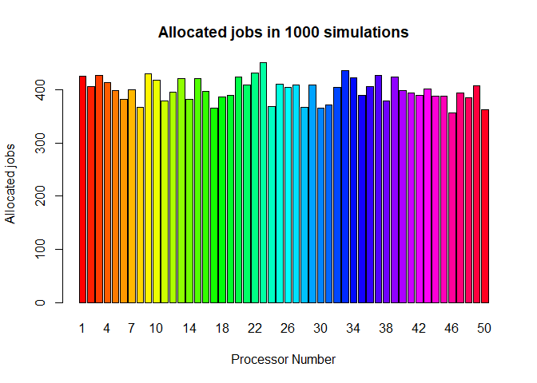
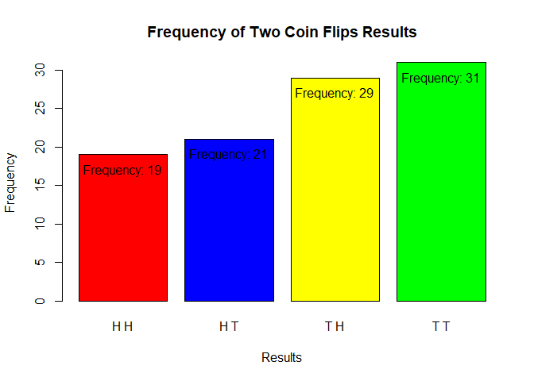

FA2_PROBABILITY_KHAFAJI
================
Mostafa Khafaji
2024-02-17

## Question 5

A series of 20 jobs arrive at a computing center with 50 processors.
Assume that each of the jobs is equally likely to go through any of the
processors.

**(a) Simulate the allocation problem a large number of times, and
estimate how many times the most used processor was used. How many of
the processors were not used at all?**

First, let’s create a thousand simulations, and plot the frequency table
made using the sample data set.

``` r
#creating probability vector
probab <- to_vec( for(x in 1:50) c(0.02))

#creating column names for ease in classification
colname <- c("Job 1", "Job 2", "Job 3","Job 4", "Job 5", "Job 6", "Job 7", "Job 8", "Job 9",
             "Job 10","Job 11", "Job 12", "Job 13", "Job 14", "Job 15", "Job 16", "Job 17",
             "Job 18", "Job 19", "Job 20")

#creating empty dataframe
sample_data <- data.frame(matrix(nrow = 0, ncol = length(colname)))
colnames(sample_data) <- colname

#creating sample dataset 
for (x in 1:1000){
  nr <- sample(50, 20, replace=TRUE, prob = probab)
  sample_data[nrow(sample_data) + 1,] <- nr
}

#creating frequency table 
freq_sample_data <- as.data.frame(table(unlist(sample_data)))
colnames(freq_sample_data)<- c("Processor Number","Jobs allocated in 1000 simulations")

#plotting frequency table
barplot(freq_sample_data$`Jobs allocated in 1000 simulations`,names.arg = freq_sample_data$`Processor Number`,xlab = "Processor Number",
        ylab = "Allocated jobs",col = rainbow(50), main = "Allocated jobs in 1000 simulations")
```

<!-- -->

As you can see from the bar plot, given that each and every processor
has an equal probability of being alloted a job, we can assume that both
the most used and the least used processor would be used to a frequency
close to (Size of choosing/Size of choices). In this case, it would be
20/50, or 40%, so that the frequency of both the most and least used are
closer to 40% of the number of simulations, which would give us 400.
Looking at the plot, you can see that our estimation is correct.

And because all the probabilities are equal, all of the processors are
used in the simulations, and therefore, there are no unused processors.

**(b) In Example 4.21, you will recall that we calculated that over 431
processors are needed to be at least 90% sure that no processor will
receive more than one of the 10 jobs to be allocated. You will agree
that this appears excessively large. To assure yourself that the answer
is correct, simulate the experiment a large number of times, and record
the usage patterns of the processors.**

First, let’s create a base case simulation, and then count the number of
rows in the data set in which a processor is used more than once, and
divide it to the total length of the original data set.

Here, let’s start with the highest number of processors that will lead
to a probability of more than 10% that there will be a situation that a
processor would work on more than one job:

``` r
  #creating probability Vector
  probabB <- to_vec( for(x in 1:431) c(1/431))

  #creating column names for ease in classification
colnameB <- c("Job 1", "Job 2", "Job 3","Job 4", "Job 5", "Job 6", "Job 7", "Job 8"
              , "Job 9", "Job 10")

#creating empty dataframe
sample_dataB <- data.frame(matrix(nrow = 0, ncol = length(colnameB)))
colnames(sample_dataB) <- colnameB

#creating sample dataset 
for (x in 1:1000){
  nr <- sample(431, 10, replace=TRUE, prob = probabB)
  sample_dataB[nrow(sample_dataB) + 1,] <- nr
}
```

After creating the data frame, create a new data frame filtered for rows
that have duplicates, and comparing the length of the filtered data
frame to the original.

``` r
 #should i iterate nalang? but baka may mas magandang function, and i need to filter pa.

#filter(duplicated == True?)
fil_sampB <- sample_dataB %>% filter(ifelse(apply(sample_dataB, 1, function(row) any(duplicated(row))),"Y","N") == "Y")

cat("The Percentage of events that had atleast one processor working on more than 1 job is:",(nrow(fil_sampB)/nrow(sample_dataB))*100,"%")
```

    ## The Percentage of events that had atleast one processor working on more than 1 job is: 9 %

Let’s redo the code, but this time, with 432 processors:

``` r
  #creating probability Vector
  probabC <- to_vec( for(x in 1:432) c(1/432))

  #creating column names for ease in classification
colnameC <- c("Job 1", "Job 2", "Job 3","Job 4", "Job 5", "Job 6", "Job 7", "Job 8"
              , "Job 9", "Job 10")

#creating empty data frame
sample_dataC <- data.frame(matrix(nrow = 0, ncol = length(colnameC)))
colnames(sample_dataC) <- colnameC

#creating sample data set 
for (x in 1:1000){
  nr <- sample(432, 10, replace=TRUE, prob = probabC)
  sample_dataC[nrow(sample_dataC) + 1,] <- nr
}

#filtering
fil_sampC <- sample_dataC %>% filter(ifelse(apply(sample_dataC, 1, function(row) any(duplicated(row))),"Y","N") == "Y")

cat("The Percentage of events that had atleast one processor working on more than 1 job is:",(nrow(fil_sampC)/nrow(sample_dataC))*100,"%")
```

    ## The Percentage of events that had atleast one processor working on more than 1 job is: 8.3 %

Then, we have shown that, for a minimum probability of 90% that no
processor would take on more than one job, given a series of 10 jobs,
over 431 processors are needed.

## Question 2

**An experiment consists of tossing two fair coins. Use R to simulate
this experiment 100 times and obtain the relative frequency of each
possible outcome. Hence, estimate the probability of getting one head
and one tail in any order.**

Using what we already know about probability, we can find the
probability of getting both a head and a tail in two draws numerically:

$\frac{2}{2}\times\frac{1}{2} = \frac{1}{2} = 0.5$

$\frac{2}{2}$ because we are expecting either heads or tails in the
first flip, then $\frac{1}{2}$ because we are expecting the opposite of
what we got in the first flip, which has the probability of 0.5 in a
fair coin.

Let’s try creating a simulation of a data set of 100 coin flips:

``` r
#create an empty data frame:
coincol <- c("Flip 1","Flip 2")
coinflip_d <- data.frame(matrix(nrow = 0, ncol = length(coincol)))
colnames(coinflip_d) <- coincol

#creating sample data set
for (x in 1:100){
  nr <- sample(c("H","T"), 2, replace = TRUE, prob = c(0.5,0.5))
  
  coinflip_d[nrow(coinflip_d)+1, ] <- nr
  
}

#creating third column, concatenating result of the two flips
coinflip_d$Result <- paste(coinflip_d$`Flip 1`,coinflip_d$`Flip 2`)


freq_coinflip <- as.data.frame(table(coinflip_d$Result))
colnames(freq_coinflip) <-c("Result","Frequency")


freq_coinflip_bar <- barplot(freq_coinflip$Frequency, names.arg = freq_coinflip$Result, main = "Frequency of Two Coin Flips Results", ylab="Frequency",xlab = "Results", col = c("red","Blue","Yellow","Green"))

text(freq_coinflip_bar, freq_coinflip$Frequency-2, paste("Frequency: ", freq_coinflip$Frequency, sep=""), cex = 1)
```

<!-- -->

You can see in the bar plot of the frequency table, that the number of
times a heads and a tails occurred in either one of the two flips is
close to 50, which is half the number of times we have sampled the
event.
